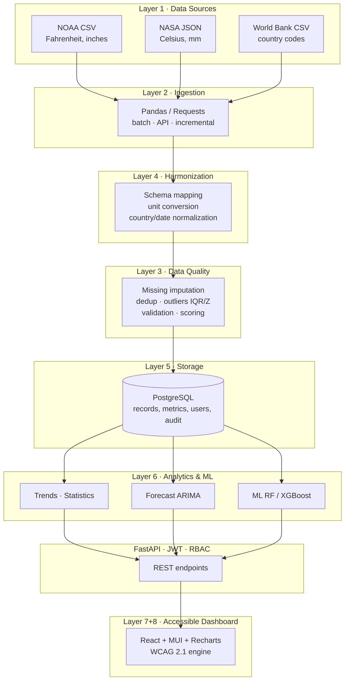

# System Architecture

The platform follows a layered data-engineering architecture.

## Layer responsibilities

| Layer | Responsibility | Key modules |
|-------|----------------|-------------|
| Ingestion | Read CSV/JSON/API into DataFrames | `app/etl/ingestion.py` |
| Harmonization | Canonical schema + unit/value normalization | `app/etl/harmonization.py` |
| Data Quality | Clean, validate, score | `app/etl/data_quality.py` |
| Orchestration | Run ETL, persist records + metrics | `app/etl/pipeline.py` |
| Storage | Relational persistence | `app/db/models.py` |
| Analytics | Trends, distributions, statistics | `app/services/analytics.py` |
| Forecasting | ARIMA + linear fallback | `app/ml/forecasting.py` |
| ML | RF/XGBoost evaluation | `app/ml/prediction.py` |
| API | REST, auth, RBAC, audit | `app/api/*` |
| Accessibility | WCAG engine, themes, TTS | `frontend/src/context/AccessibilityContext.jsx` |

## Security
- JWT bearer tokens (HS256), bcrypt password hashing.
- Hierarchical RBAC: `viewer < analyst < admin` enforced via FastAPI dependencies.
- Audit logging of sensitive actions (login, user creation, ETL runs, uploads).

## Deployment
Three Docker services orchestrated by Docker Compose: `db` (PostgreSQL),
`backend` (FastAPI/uvicorn), `frontend` (nginx serving the built React SPA and
proxying `/api`).
