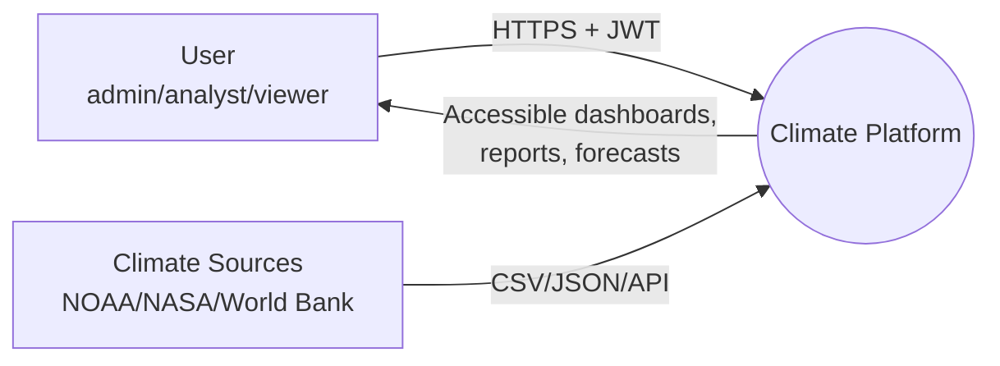
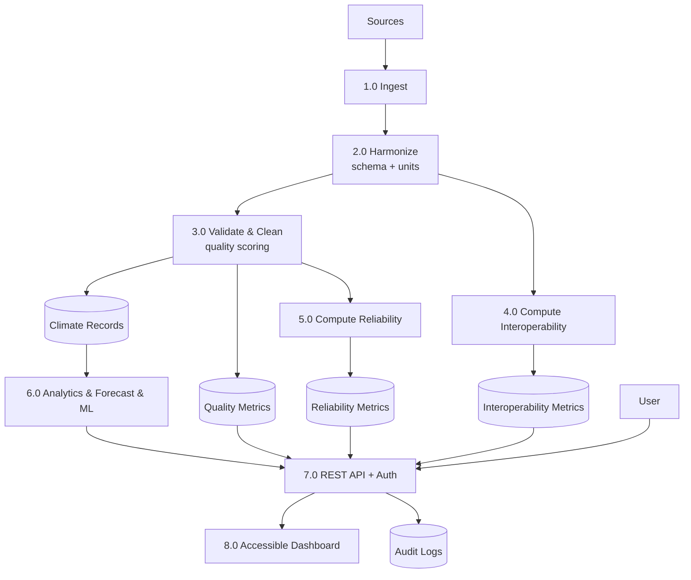
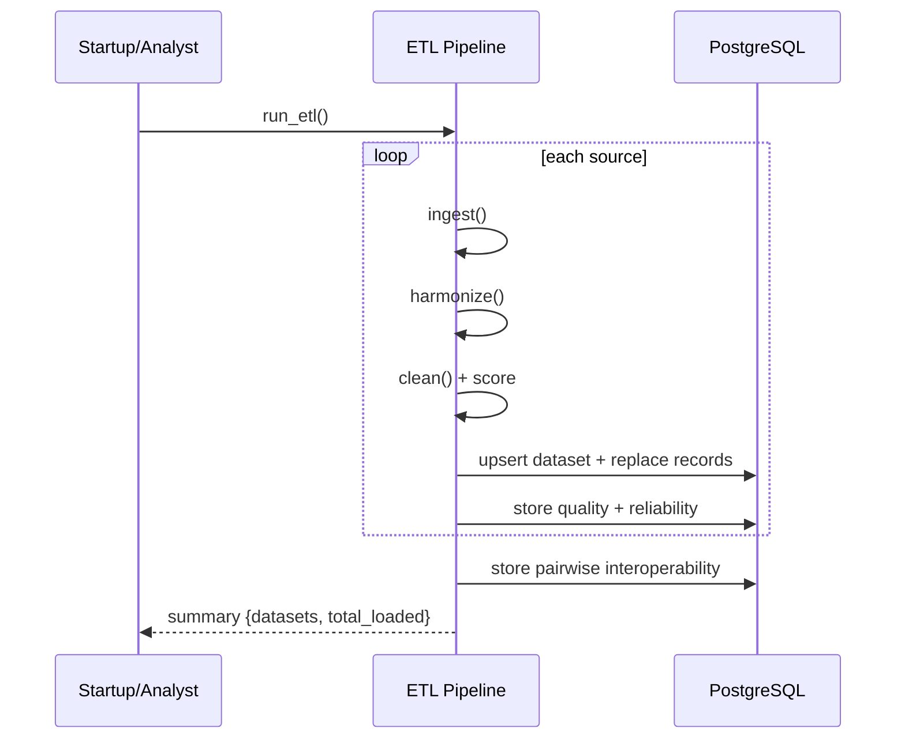

# Data Flow Diagram

## Level 0 (Context)

```mermaid
flowchart LR
    U[User<br/>admin/analyst/viewer] -->|HTTPS + JWT| P((Climate Platform))
    S[Climate Sources<br/>NOAA/NASA/World Bank] -->|CSV/JSON/API| P
    P -->|Accessible dashboards,<br/>reports, forecasts| U
```

## Level 1 (Processes)

```mermaid
flowchart TD
    S[Sources] --> P1[1.0 Ingest]
    P1 --> P2[2.0 Harmonize<br/>schema + units]
    P2 --> P3[3.0 Validate & Clean<br/>quality scoring]
    P3 --> D1[(Climate Records)]
    P3 --> D2[(Quality Metrics)]
    P2 --> P4[4.0 Compute Interoperability]
    P4 --> D3[(Interoperability Metrics)]
    P3 --> P5[5.0 Compute Reliability]
    P5 --> D4[(Reliability Metrics)]

    D1 --> P6[6.0 Analytics & Forecast & ML]
    P6 --> API[7.0 REST API + Auth]
    D2 & D3 & D4 --> API
    API --> UI[8.0 Accessible Dashboard]
    API --> D5[(Audit Logs)]
    U[User] --> API
```

## ETL sequence

```mermaid
sequenceDiagram
    participant Sch as Startup/Analyst
    participant Pipe as ETL Pipeline
    participant DB as PostgreSQL
    Sch->>Pipe: run_etl()
    loop each source
        Pipe->>Pipe: ingest()
        Pipe->>Pipe: harmonize()
        Pipe->>Pipe: clean() + score
        Pipe->>DB: upsert dataset + replace records
        Pipe->>DB: store quality + reliability
    end
    Pipe->>DB: store pairwise interoperability
    Pipe-->>Sch: summary {datasets, total_loaded}
```
