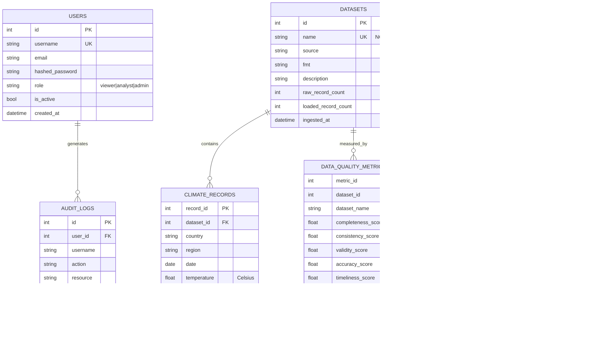

# Entity-Relationship Diagram

```mermaid
erDiagram
    USERS ||--o{ AUDIT_LOGS : generates
    DATASETS ||--o{ CLIMATE_RECORDS : contains
    DATASETS ||--o{ DATA_QUALITY_METRICS : measured_by
    DATASETS ||--o{ RELIABILITY_METRICS : measured_by

    USERS {
        int id PK
        string username UK
        string email
        string hashed_password
        string role "viewer|analyst|admin"
        bool is_active
        datetime created_at
    }

    AUDIT_LOGS {
        int id PK
        int user_id FK
        string username
        string action
        string resource
        string detail
        datetime created_at
    }

    DATASETS {
        int id PK
        string name UK "NOAA|NASA|WorldBank"
        string source
        string fmt
        string description
        int raw_record_count
        int loaded_record_count
        datetime ingested_at
    }

    CLIMATE_RECORDS {
        int record_id PK
        int dataset_id FK
        string country
        string region
        date date
        float temperature "Celsius"
        float rainfall "mm"
        float humidity "percent"
        string source
    }

    DATA_QUALITY_METRICS {
        int metric_id PK
        int dataset_id FK
        string dataset_name
        float completeness_score
        float consistency_score
        float validity_score
        float accuracy_score
        float timeliness_score
        float overall_score
        int duplicates_removed
        int outliers_detected
        int missing_imputed
        datetime created_at
    }

    INTEROPERABILITY_METRICS {
        int metric_id PK
        string source_a
        string source_b
        float schema_compatibility
        float semantic_compatibility
        float mapping_success_rate
        float integration_score
        datetime created_at
    }

    RELIABILITY_METRICS {
        int metric_id PK
        int dataset_id FK
        string dataset_name
        float completeness
        float consistency
        float accuracy
        float availability
        float reliability_score
        datetime created_at
    }
```

`INTEROPERABILITY_METRICS` rows are pairwise across sources (e.g. NOAA↔NASA) and
are therefore not bound to a single dataset foreign key.
